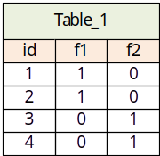
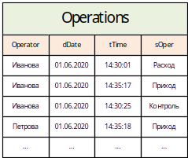
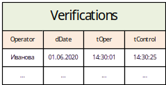

**Вопросы по базам данных**

Все приведенные ниже задания необходимо решать с точки зрения оптимизации скорости выполнения и, как следствие, экономии серверных ресурсов во времени. Если сервер тратит относительно небольшие ресурсы, но выполняет запрос долго – это так же считается неоптимальным решением.

Желательно код писать на PostgreSQL

1. Есть таблица с автоинкрементным полем **id**, в которой имеются задвоенные записи. Как правильно удалить задвоения в таблице?



2. Имеется таблица с операциями



В таблице более 10 миллионов записей. Операторы проводят различные операции, некоторые из них требуют контроля. Оператор не может провести следующую операцию не проведя контроль предыдущей, если он требуется. Необходимо заполнить следующую таблицу, куда попадут только операции, подлежащие контролю (tOper – время операции, tControl – время контроля):



3. Есть несколько таблиц идентичных по структуре, но хранящих счета в разных банках.

Accounts_01, Accounts_02, Accounts_03, где 01, 02, 03 это номера банка. Есть представление Accounts объединяющее эти таблицы и имеющее номер банка. В таблицах, в общей сложности, более миллиарда записей.

Необходимо написать функцию, которая по номеру банка, фамилии и дате рождения клиента будет искать все его счета в этом банке.

Таблицы Представления


4. В таблице клиентов Clients_1 у каждого клиента есть уникальный ID, однако не у всех проставлена дата рождения. Есть другая таблица клиентов Clients_2, где так же имеется аналогичная проблема. ID в обеих таблицах привязаны к уникальному клиенту, т.е. Иванов И.И. с ID = 100 в обеих таблицах будет указывать на одного и того же клиента.

Необходимо написать запрос, собирающий даты рождения из обеих таблиц. Если ДР нет в первой таблице надо брать из второй и наоборот. Те клиенты, по которым не найдется ДР ни в одной из таблиц так же должны попасть в выборку, но без даты рождения.

Структура обеих таблиц клиентов:


5. Постройте индексы в таблицах Accounts_01 и Accounts_02 из вопроса №3, для оптимизации выполнения следующего запроса:
```
select \* from Accounts_01 a1 join Accounts_02 a2
on a1.FIO = a2.FIO and a1.dBirth = a2.dBirth
where a1.FIO = ‘Иванов Иван Иванович’ and a1.dBirth = ‘1990-05-17’
and left(a1.account,3) != ‘408’
```
6. Три таблицы Clients, Accounts и Operations описыСввают операции клиентов. В таблице Clients 50 млн. клиентов, в таблице Accounts 200 млн. счетов, в таблице Operations 1 млрд. операций. Связка следующая: Clients.id = Accounts.id_client, Accounts.id = Operations.id_account

Необходимо написать запрос, выбирающий сумму операций клиента Иванова Ивана Ивановича 17.05.1990 за июнь 2020 года.

Структура таблиц:


7. Есть csv файл размером 20 gb. Первые 3 строки из него выглядят следующим образом.

"Letter",   "Frequency",    "Percentage"

"A",    24373121,   8.1

"B",    4762938,    1.6

Задача: переложить данные из файла в таблицу на Postgresql. Результат представить в виде кода на Python.