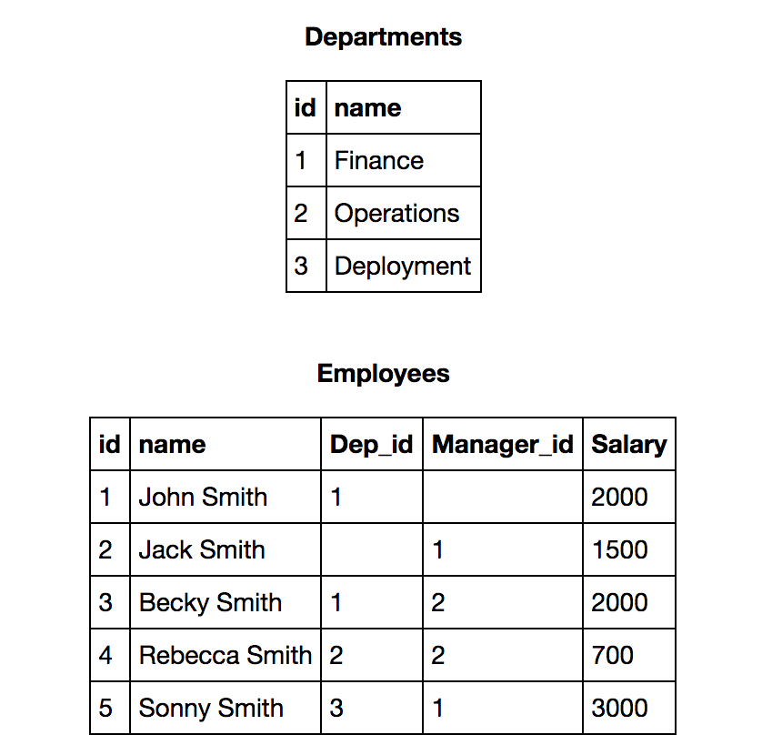
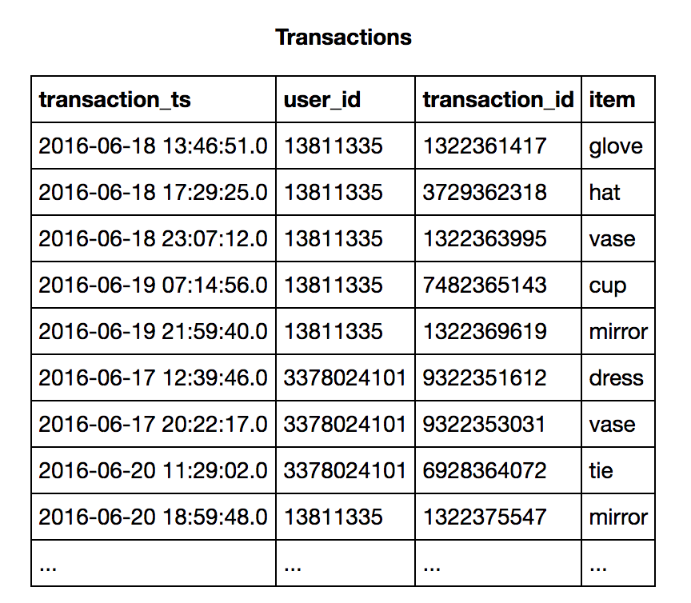

## Типичная задача продуктового аналитика:
Представь, что ты продуктовый аналитик в Instagram и отвечаешь за аналитику продукта Истории (Stories). Спустя несколько месяцев после его запуска тебя попросили собрать продуктовый дашборд про успешность запуска, первые результаты работы этого продукта и его влияния на весь продукт Instagram. 
Напиши, пожалуйста, метрики, которые бы ты отобразил на этом дашборде в порядке убывания важности (здорово если построишь пирамиду/иерархию метрик)

## Типичный А/В тест продуктового аналитика:
На сайте запущен А/В тест с целью увеличить доход. В приложенном excel файле ты найдешь сырые данные по результатам эксперимента (user_id), тип выборки (variant_name) и доход, принесенный пользователем (revenue).
Проанализируй результаты эксперимента и напиши свои рекомендации менеджеру.
(приложи скрипт с помощью которого анализировал данные, желательно файл .ipynb на python)

## Обычная SQL задача 1

**Используя таблицы выше, напиши следующие SQL запросы:**
    a) Для каждого сотрудника найти его департамент, включая тех, у кого департамента нет
    b) Найти наибольшую зарплату по департаментам и отсортировать департаменты по убыванию максимальной зарплаты

## Обычная SQL задача 2

**Используя таблицу выше, напиши следующие SQL запросы:**
    a) Посчитай доход с женской аудитории (доход= сумма price*items)
    b) Сравни доход по группе мужчин и женщин
    c) Посчитай кол-во уникальных пользователей-мужчин, заказавших  более чем три айтема  (суммарно за все заказы).

## Не самая обычная SQL задача 3

**Каждый пользователь имеет набор транзакций с определенным временем. Используя таблицы выше, напиши НАИБОЛЕЕ ОПТИМАЛЬНЫЕ SQL запросы:**
    a) Выведи для каждого пользователя первое наименование, которое он заказал (первое по времени транзакции)
    b) Посчитай сколько транзакций в среднем делает каждый пользователь в течении 72х часов с момента первой транзакции